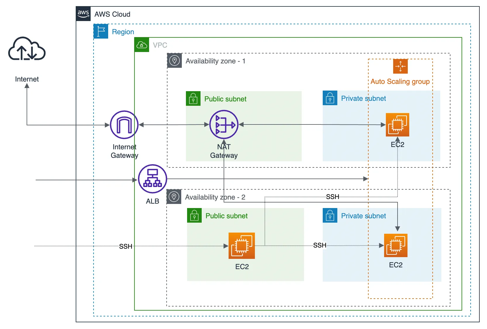

# AWS Infrastructure Operations Project: Deploying a IaaS web server in AWS

## Introduction
This project was made to practice using AWS with Terraform and Packer. The purpose of this project was to make a similar [project](https://github.com/m2rtenm/nd082-Azure-Cloud-DevOps-Starter-Code/tree/master/C1%20-%20Azure%20Infrastructure%20Operations/project/starter_files) that was done for Udacity's Nanodegree with Azure. The solution for the project was brought to AWS context and was extended a bit as well.

## Architecture

The final solution of this project consists of following parts:
* VPC with two public subnets and two private subnets in different availability zones
* An Internet Gateway for internet traffic
* NAT Gateway attached to the private subnets, so the private subnets can connect to the internet
* Auto scaling group and launch templates to the EC2 Instances
* Security groups and route tables to enable traffic between subnets, NAT and Internet Gateways
* Application Load Balancer for the EC2 auto scaling group
* Bastion EC2 Instance to SSH into the EC2 instances running in private subnets

## Dependencies
1. Create an [AWS Account](https://aws.amazon.com/)
2. Install [AWS CLI](https://docs.aws.amazon.com/cli/latest/userguide/getting-started-install.html)
3. Install [Packer](https://www.packer.io/downloads)
4. Install [Terraform](https://www.terraform.io/downloads.html)

## Terraform configuration

### Provider
The code adds AWS as a provide and sets the credentials, so they are not needed to export every time in new terminal session. The prerequisite is that the credentials file is existing.

### Variables
The variables section provides an overview of values that might change, according to how the configuration will be implemented. Every variable has a default value.

### Network
In this section, the Virtual Private Cloud (VPC) is built with:
* 2 public subnets accessed via internet using Internet Gateway
* 2 private subnets which are not exposed to the internet directly and are private to the VPC
* NAT Gateway in the public subnet and attached to the private subnets using route tables, so the private subnets can access the internet

### Key Pair
This section provides the key pair resource generated by Terraform that the EC2 instances will use.

### Security groups
In this section, two security groups are created:
* One for EC2 instances - allows all inbound traffic on port 22 for SSH, allows all traffic only from the Load Balancer, allows all outbound traffic.
* One for the Load Balancer - allows all inbound traffic on port 80, allows all outbound traffic.

### Load Balancer
This section provides an overview of the Load Balancer, listeners and target groups that are attached to the autoscaling group

### Launch Configuration
In this step, an EC2 instance named Bastion is created in the public subnet and a public IP address is assigned to it. This isatnaces is used to SSH to the instnaces on the private subnets. The launc configuration also has a EC2 launch template which is used in the autoscaling group.

### Autoscaling
The autoscaling group will define the scalability. The minimum, maximum and desired amount of EC2 instances are configured that can be created in the attached subnets.

### Outputs
The outputs are printing out the Load Balancer DNS name. It can be used to test if the EC2 launch configuration was deployed correctly.